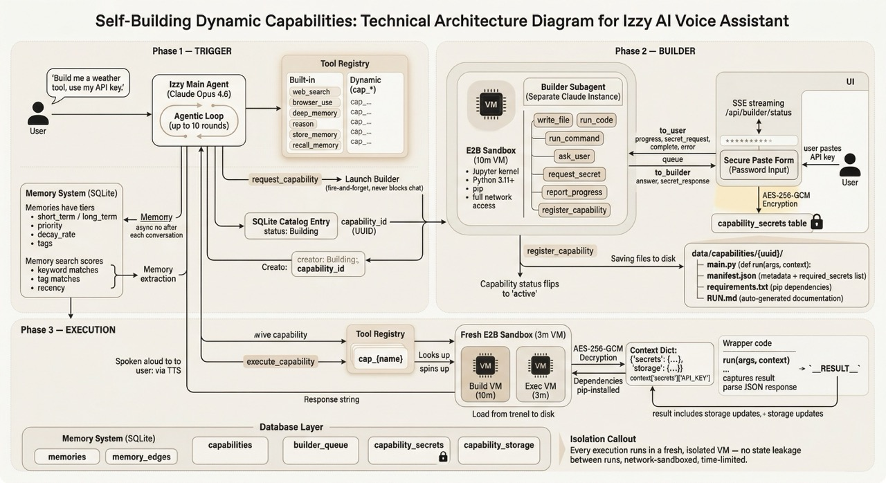

# Izzy

**A voice-first AI agent that writes its own tools.**

Izzy is an always-on voice companion that starts with a small set of primitives and dynamically builds new capabilities at runtime. Ask for the weather, it writes the weather tool. Ask it to send an email, it builds that too. Each tool is tested in a sandbox, saved to a catalog, and reused on future requests. Over time, the agent's toolset becomes uniquely shaped by how you use it.

Built with [Claude Code](https://claude.ai/code) during the "Built with Claude Code Opus 4.6 Hackathon".

<!-- Add an image here -->
Checkout the demo here: https://youtu.be/XtdLzGeoDsA





---

## The Problem

Most agent frameworks require developers to anticipate every tool upfront. You write a weather function, an email sender, a calculator, wire them all up, and hope you covered enough use cases. This creates three bottlenecks:

1. **High friction** — Getting a capable agent means building a comprehensive tool library before it's useful.
2. **One-size-fits-all** — Every user gets the same tools regardless of what they actually need.
3. **Context bloat** — Loading every tool definition into every LLM call wastes context and money.

## The Approach

Izzy flips the model: **bootstrap with primitives, build on demand.**

The agent starts with a few built-in tools (web search, URL reading, memory, reasoning, and capability management). When it encounters a request it can't handle, it dispatches a Builder subagent that writes the tool, tests it, and registers it — all while the main conversation continues.

### Two-Sandbox Architecture

The system uses [E2B](https://e2b.dev) to isolate both building and execution:

```
User: "What's the weather in Austin?"
  │
  ├─ Agent checks catalog → no weather tool found
  │
  ├─ Agent calls request_capability("weather_lookup", ...)
  │   └─ Builder Sandbox (10 min lifetime)
  │       ├─ Writes main.py with weather API logic
  │       ├─ Writes requirements.txt
  │       ├─ Tests the code in sandbox
  │       ├─ Reports progress via SSE
  │       └─ Registers capability → status: active
  │
  ├─ Agent tells user: "I'm building a weather tool for you..."
  │
  └─ (Next request) Agent calls execute_capability("weather_lookup", ...)
      └─ Executor Sandbox (3 min lifetime)
          ├─ Installs dependencies
          ├─ Runs def run(args) -> str
          └─ Returns result to agent → spoken to user
```

The Builder runs **in parallel** with the main conversation. It can prompt the user for clarification if needed (e.g., "Do you have a preferred weather API key?"), otherwise it works autonomously in the background. Progress updates stream to the UI in real time via SSE.

### The Four-File Convention

Every capability the Builder creates produces four files:

| File | Purpose |
|------|---------|
| `main.py` | The tool implementation. Must export `def run(args: dict) -> str` |
| `requirements.txt` | Python dependencies (kept minimal) |
| `manifest.json` | Metadata: name, description, version, input/output schemas |
| `RUN.md` | Detailed usage instructions for the Executor agent |

### The RUN.md Pattern

This is the design decision I'm most proud of.

When the Executor agent needs to use a custom capability, it doesn't need the full tool documentation loaded into the system prompt. Instead:

1. **Metadata lookup** — Tool name, description, and input schema live in SQLite. The agent checks this catalog only when it suspects tooling is relevant — not on every call.
2. **On-demand detail** — If the metadata alone isn't enough, the agent can read the `RUN.md` for that specific capability, which contains detailed usage instructions, edge cases, and examples.

This acts as a **localized, on-demand prompt injection** — the Executor knows exactly how to drive the custom tool without cluttering the main system prompt with documentation for every capability ever built.

### Lazy Tool Loading

Not all tools are loaded on every LLM call. The flow:

1. Active capabilities are summarized in the system prompt (name + one-line description only)
2. The agent has `lookup_capability` to search the catalog by keyword
3. Only when executing does the full schema get loaded
4. `RUN.md` is available for deep-dive reference if needed

This keeps context lean while still giving the agent access to an unbounded tool library.

---

## Architecture

### Tech Stack

- **Frontend**: Next.js 16 (App Router), React 19, Tailwind v4
- **AI**: Claude Sonnet 4 via Anthropic SDK
- **Sandboxing**: E2B Code Interpreter (Python 3.11+)
- **Database**: SQLite via better-sqlite3 (WAL mode)
- **Speech**: Web Speech API (recognition + synthesis)
- **Web Search**: Tavily API

### System Architecture

```
┌─────────────────────────────────────────────────────┐
│  Browser                                            │
│  ┌──────────┐  ┌──────────┐  ┌───────────────────┐ │
│  │  Speech   │  │  State   │  │   Tool Overlays   │ │
│  │  Engine   │──│ Machine  │──│  (Web/Memory/     │ │
│  │ (Web API) │  │ idle→    │  │   Builder/Reason) │ │
│  │          │  │ listen→  │  │                   │ │
│  │          │  │ think→   │  │                   │ │
│  │          │  │ speak    │  │                   │ │
│  └──────────┘  └────┬─────┘  └───────────────────┘ │
│                     │ SSE                           │
└─────────────────────┼───────────────────────────────┘
                      │
┌─────────────────────┼───────────────────────────────┐
│  Next.js Server     │                               │
│                     ▼                               │
│  ┌─────────────────────────────────┐                │
│  │  POST /api/chat                 │                │
│  │  ┌───────────┐ ┌─────────────┐  │                │
│  │  │  Memory   │ │ Capability  │  │                │
│  │  │  Context  │ │  Context    │  │                │
│  │  └─────┬─────┘ └──────┬──────┘  │                │
│  │        └───────┬───────┘         │                │
│  │                ▼                 │                │
│  │  ┌─────────────────────────┐    │                │
│  │  │    Agentic Loop         │    │                │
│  │  │  Claude Sonnet 4        │    │                │
│  │  │  (up to 10 rounds)      │    │                │
│  │  └────────┬────────────────┘    │                │
│  │           │                     │                │
│  └───────────┼─────────────────────┘                │
│              │ tool calls                           │
│     ┌────────┴──────────────┐                       │
│     ▼                       ▼                       │
│  ┌──────────────┐  ┌───────────────┐                │
│  │  Built-in    │  │  Capability   │                │
│  │  Tools       │  │  Executor     │                │
│  │  - web_search│  │  (E2B sandbox)│                │
│  │  - browser   │  │               │                │
│  │  - memory    │  └───────┬───────┘                │
│  │  - reason    │          │                        │
│  │  - catalog   │  ┌───────┴───────┐                │
│  └──────────────┘  │    Builder    │                │
│                    │   Subagent    │                │
│                    │  (E2B sandbox)│                │
│  ┌──────────────┐  │  10 min, 25  │                │
│  │   SQLite     │  │  iterations  │                │
│  │  - memories  │  └──────────────┘                │
│  │  - catalog   │                                   │
│  │  - queue     │                                   │
│  └──────────────┘                                   │
└─────────────────────────────────────────────────────┘
```

### Client-Side State Machine

The voice interface is driven by a deterministic state machine:

```
idle ──SPEECH_DETECTED──▶ listening
idle ──IDLE_TIMEOUT─────▶ thinking

listening ──TRANSCRIPT_FINAL──▶ thinking

thinking ──RESPONSE_READY──▶ speaking
thinking ──PROMPT_READY────▶ speaking

speaking ──SPEECH_DONE──▶ idle
```

States map to UI behavior: `listening` activates the mic, `thinking` shows tool activity overlays, `speaking` drives text-to-speech output.

### Memory System

Izzy remembers things about users across conversations:

- **Two tiers**: `short_term` (2% decay per cycle) and `long_term` (0.5% decay per cycle)
- **Scoring**: Combines base priority + tag matches + content relevance + recency boost
- **Extraction**: After each conversation exchange, Claude asynchronously extracts notable facts and stores them
- **Decay**: Priority naturally decreases over time — important memories persist, trivia fades
- **Graph**: `memory_edges` table supports relationship tracking between memories

### Built-in Tools

| Tool | Purpose |
|------|---------|
| `web_search` | Search the web via Tavily |
| `browser_use` | Fetch and parse URL content with Readability |
| `deep_memory` | Thorough memory search with reasoning |
| `reason` | Step-by-step reasoning for complex questions |
| `store_memory` | Explicitly save a user fact |
| `recall_memory` | Search memories by keywords/tags |
| `lookup_capability` | Check if a capability exists in the catalog |
| `request_capability` | Trigger the Builder to create a new tool |
| `execute_capability` | Run an active capability in a sandbox |
| `ask_user` | Ask a clarifying question (short-circuits the loop) |

---

## Getting Started

### Prerequisites

- Node.js 18+
- An [Anthropic API key](https://console.anthropic.com/)
- An [E2B API key](https://e2b.dev/) (for capability building/execution)
- A [Tavily API key](https://tavily.com/) (for web search)

### Setup

```bash
# Clone the repository
git clone https://github.com/yourusername/izzy-claude.git
cd izzy-claude

# Install dependencies
npm install

# Configure environment
cp .env.example .env.local
# Edit .env.local with your API keys

# Start the dev server (HTTPS required for Web Speech API)
npm run dev
```

Open `https://localhost:3000` in your browser. Grant microphone access when prompted. Start talking.

### Project Structure

```
app/
  page.tsx                    # Main voice interface
  api/
    chat/route.ts             # Core chat endpoint (agentic loop)
    builder/route.ts          # Trigger capability builds
    builder/status/route.ts   # SSE stream for build progress
    capabilities/route.ts     # List capabilities
    memory/route.ts           # Memory endpoints

lib/
  agent/                      # Client-side state machine + speech
  tools/                      # Tool system (registry, executor, loop)
    primitives/               # Built-in tool implementations
  capabilities/               # Capability catalog + sandbox execution
  builder/                    # Builder subagent (system prompt, tools, loop)
  memory/                     # Memory store, search, decay, graph
  sandbox/                    # E2B client wrappers
  queue/                      # SQLite message queue for builder progress
  canvas/                     # Wave visualization renderer

components/
  WaveCanvas.tsx              # Animated background
  ToolOverlay.tsx             # Active tool display
  tool-overlays/              # Specialized overlays per tool type

data/
  izzy.db                     # SQLite database
  capabilities/               # Stored capability source files
```

---

## Design Decisions

### Why voice-first?

Voice is the lowest friction interface. No typing, no clicking, no context switching. The agent listens continuously, responds conversationally, and handles tool use transparently. The goal is an assistant that feels like talking to a person, not using software.

### Why Python for capabilities?

Python has the richest ecosystem for the kinds of tasks people ask AI assistants to do — data processing, API calls, web scraping, math, file manipulation. The E2B sandbox provides a full Python 3.11+ environment with network access, so capabilities can call external APIs, install packages, and use the standard library.

### Why SQLite?

Single-file database, zero configuration, WAL mode for concurrent reads. Perfect for this demo where the data model is simple (memories, capabilities, build queue) would be moved to something like PG to handle embeddings and consine sim search.

### Why not just load all tools every call?

With a growing capability catalog, loading every tool definition into every API call would:
1. Waste tokens and increase latency
2. Confuse the model with irrelevant options
3. Hit tool count limits as the catalog grows

The lazy loading pattern (catalog summary in system prompt → lookup by keyword → full schema on execute) keeps the context focused while still making the entire catalog accessible.

---

## Future Directions

- **Capability versioning and rollback** — The schema already has `version`, but the upgrade/rollback flow isn't built yet
- **Capability sharing** — Export/import capability bundles between Izzy instances
- **Full-text search** — Replace keyword-based memory search with SQLite FTS5
- **Capability composition** — Let the agent chain multiple capabilities in a single execution
- **Remote storage** — Move capability files from local filesystem to S3/R2 for deployment

---

## License

MIT

---

Built with [Claude Code](https://claude.ai/code) by Russell Van Curen.
